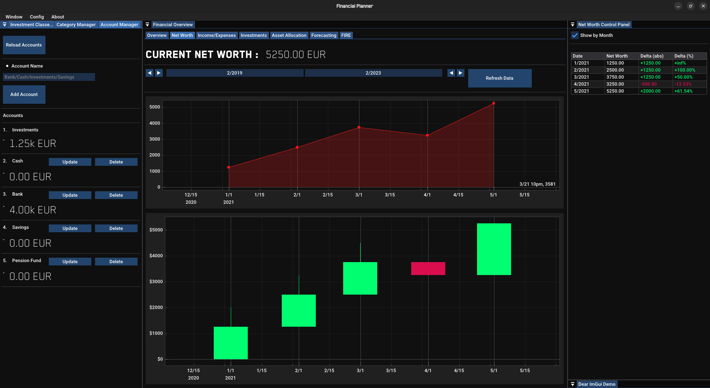
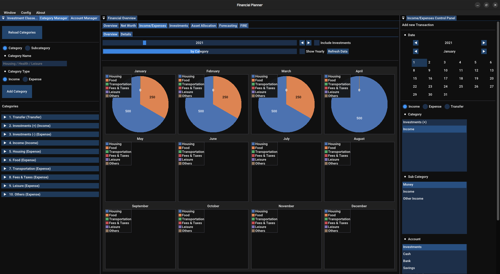
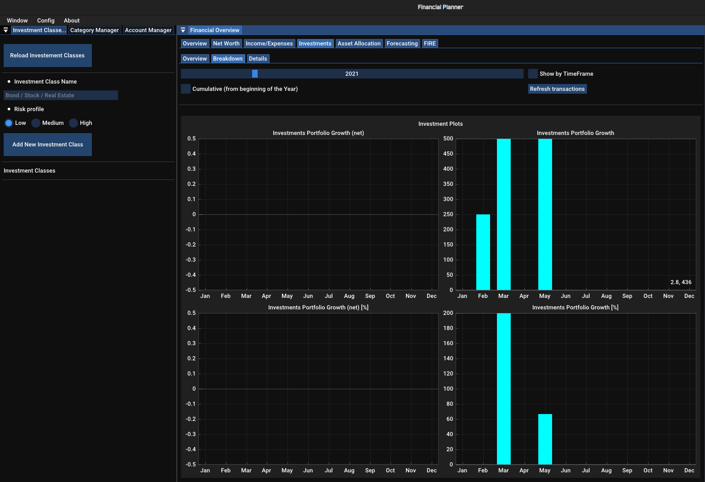

# FinancialPlanner
Personal Finance Planner  

Current Stable Version : **Version 0.3.1**

## License and Copyright
� 2022 Alberto Foti. All Rights Reserved.

## For Final Users
There isn't a proper installation procedure yet. (The product is still in development)

## Images

## Future Objectives
- Deployment (installer wizard or something similar)
- Software Icon
- Allow currency customization
- System to manage multiple accounts [Edit]
- Category/sub_category Manager [Edit]
- sub_category Manager [Delete]
- Transactions operations [Edit] [Delete] done with popup forms
- Asset allocation new record [Edit] [Delete] done with popup forms
- Income/Expenses : Overview tab [monthly by subcat, yearly by subcat]
- Investments Tab : breakdown [5 years, 10 years, 25 years, 50 years] views
- Income/Expenses second plots page (other plots :) )
- Forecasting tab
- FIRE tab

## Version 0.4.0 Objectives
- fix: when deleting account proceed in deleting all account related transactions (give an option to clear or not the data) and manage account accesses/conflicts after delete
- Dynamic GUI: 1080p / 2k versions
- Asset Allocation tab : backend logic (assets, location, currency exposure, ...)
- refactor: function to get proper button sizes (dynamic button sizes clean and organized)

## Version 0.3.2 Objectives
- Dynamic Investment Classes Manager (with backend integration)

## Version 0.3.x Features
- fix: bugs hunting
- refactor: warnings, fixes, deprecated functions
- GUI: new layout (+ Manager tab)

### Versions 0.2.x Features
- 0.3.0 Stable version. Multiplatform capabilities.
- 0.2.7 Transaction Comments, style: inc/exp details tab GUI upgrade, new metrics in inc/exp details tab, popups instead of error text messages, Asset Allocation GUI
- 0.2.6 IncomeExpenses tab: Adding a table for transfers, Allow Transfer between Accounts
  Fix: account plots fix
  Investment tab fix: money transfer logic integration with investments(deposits/withdrawal)
- 0.2.5 Control check function for new transactions, Investments: GUI complete, plots created, Transfers between accounts
  Fix : Return investments report without holes (filled at runtime)
  Fix : show yearly view in net worth control panel
- 0.2.4 Investments: plots and tabs upgrade, Full GUI improvement, New font (Roboto) available, Calendar Widget,
  Fix : not possible to add categories with the same name as an existing category
  Fix : not allowing the [delete] of Investments account and related issues
  Fix : Returns monthly reports without holes (filled at runtime)
- 0.2.3 Investments: breakdown GUI and plots, Income/Expenses Detail: add investments returns column, including/excluding investments into pie charts
- 0.2.2 Backend System optimization (structure rethink), Investments Tab GUI and logic, Fix : memory leaks, performance issues
- 0.2.1 tabs added(Investments,Asset Allocation,Forecasting,FIRE), Major refactor and documentation, Income/Expenses : Overview tab [monthly by cat, yearly by cat]

### Versions 0.1.x Features
- 0.2.0 : Delete accounts enabled, Category delete
- 0.1.9 : database upgrade, Accounts tracking and plots, Net Worth / IncomeExpenses / Account tabs link implementation
- 0.1.8 : Backend System upgrade (modularity, enabling sorting, ...), Income/Expenses (GUI, details tab), Category/sub_category Manager
- 0.1.7 : Font/themes options, Backend System, System to manage multiple accounts, NW tab : GUI structure + backend link
- 0.1.6 : new windows/tabs (basic GUI structure), Source files structure upgrade and fix
- 0.1.5 : Style: Dark mode upgrade, Font: Whole Blender Pro Package imported
- 0.1.4 : Basic forecasting plot for compound interest calculator window, Font upgrade (Blender Medium Pro)
- 0.1.3 : Test window upgrade
- 0.1.2 : in App Docking Space for frames, Empty Test window
- 0.1.1 : Basic Compound Interest Calculator

## Libraries Used and other Dependencies
- vcpkg library manager  
- ImGui library (docking branch)
- ImPlot library for plotting
- jsoncpp to manage JSON files in c++
- Font list: Blender Pro, Roboto 

Font made from <a href="http://www.onlinewebfonts.com">oNline Web Fonts</a> is licensed by CC BY 3.0

